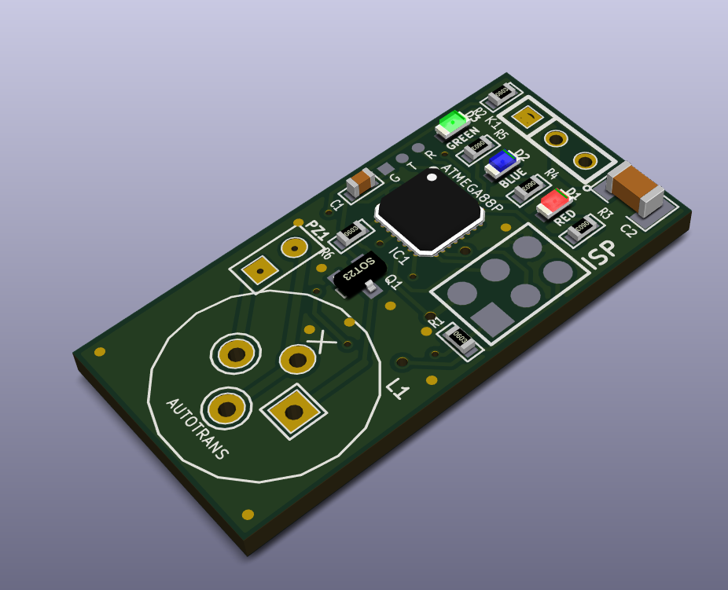

# Open Source RC Lost Model Alarm 
* Two modes -- Normal (manual switch) or Inactivity
* Modes programmable from TX 
* Resonated PIEZO
* LOUD!

Hardware design created in free, open source KiCAD EDA suite.

Employs ATmega88PA (5x5mm MLF) to intelligently drive a quartz piezo via autotransformer at 2.8KHz resonant frequency. This gives air and ear peircingly, LOUD output. Piezo and transformer taken from cheap personal alarm.

The circuit board is 16x33mm and the piezo is 28mm diameter and 3mm thick, including resonance chamber. The autotransformer (11mm height) can be mounted either on the top or bottom of the PCB or off board, if needed for space.

There are three status LEDs. Green, Blue and Red. They do, umm, stuff.

Programming and status tones are emitted (at lower, close range tolerable volume levels!) using Morse code, which I consider better than counting beeps for programming and status reporting.

The alarm can work in either Normal or Inactivity mode.

In Inactivity mode, ear peircing noise is made when there has been no receiver channel activity for a short while. Useful for cases where a dedicated RC channel is not available. Connect to aileron or elevator channel, for example.

Nomrml mode uses a dedicated receiver channel as a simple on/off switch. (Greater than or lower than mid point.)

## KiCAD v4 PCB Render

Autotransformer and off-board quartz piezo not shown.
